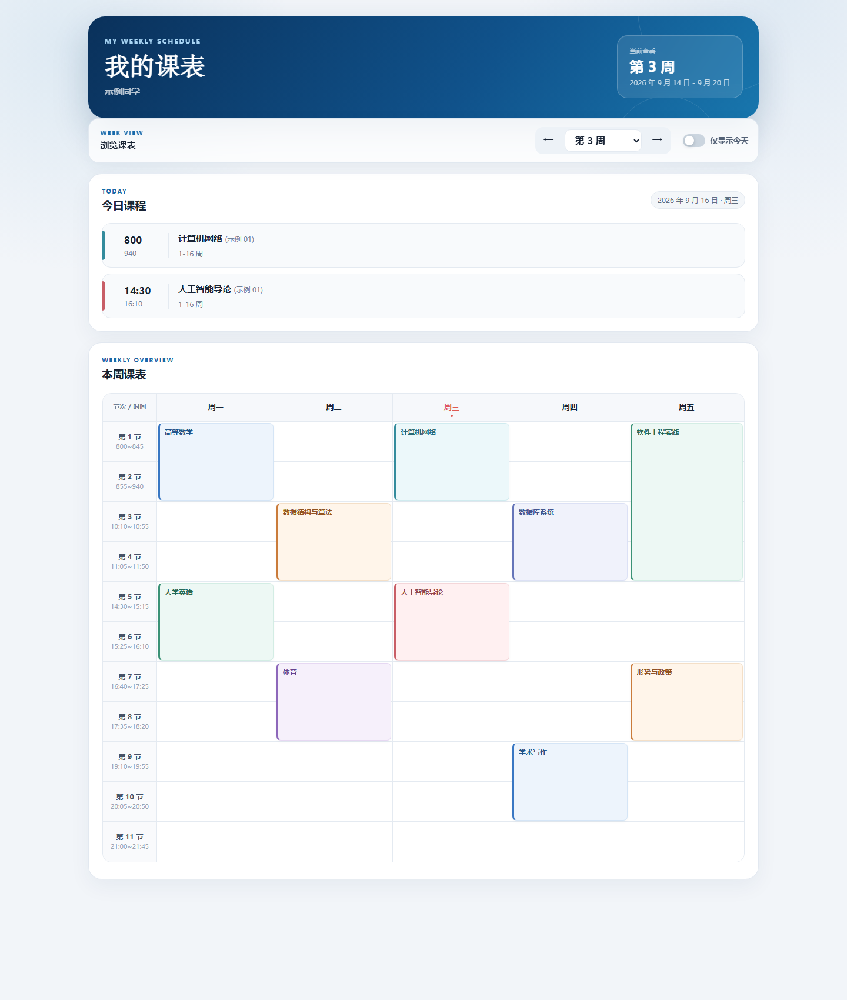

# 厦大课表

使用学号 / 工号和密码登录厦门大学统一身份认证，拉取当前学期课表，并生成一个自包含的 HTML 页面。

页面包含：

- 今日课程
- 周一至周五课表
- 周次切换
- 点击课程查看教师、教室、班级、周次和时间
- 手机端自适应布局

## 页面示例

下面是生成页面的脱敏预览（示例数据仅用于展示界面）：



也可以直接打开 [示例页面](docs/schedule-demo.html) 或 [示例图原文件](docs/schedule-demo.png) 查看大图。

## 安装依赖

```bash
pip install -r requirements.txt
```

## 配置

复制示例配置并填写账号：

```bash
copy config.example.json config.json
```

`config.json` 含密码，已被 `.gitignore` 忽略，请勿提交到公开仓库。

也可以使用环境变量：

```text
XMU_USER=学号或工号
XMU_PASS=密码
```

命令行参数的优先级高于环境变量和 `config.json`。

## 使用

```bash
python fetch_schedule.py                         # 使用 config.json
python fetch_schedule.py --user X --password Y   # 直接指定账号密码
python fetch_schedule.py --week 3                # 查看第 3 周
python fetch_schedule.py --term 20252            # 指定学年学期代码
python fetch_schedule.py --no-open               # 生成但不打开浏览器
python fetch_schedule.py --out out/my.html       # 指定输出路径
```

运行后默认生成 `schedule.html`。该文件包含个人课表数据，默认被 `.gitignore` 忽略；如果要部署页面，请确认其中没有不希望公开的信息。

## 工作原理

脚本使用 Python `requests.Session` 模拟 HTTP 会话：

1. 请求 CAS 登录页，读取动态参数。
2. 按前端规则使用 `AES-128-CBC / PKCS7` 加密密码并提交登录表单。
3. 跟随门户重定向，使用 CAS Ticket 获取教务微应用会话。
4. 调用教务接口，拉取学期、周次、节次、学生信息和完整学期课表。
5. 将前端实际需要的数据内嵌到单文件 HTML 中。

课表接口不传 `ZC` 参数，而是拉取完整学期课程，再由前端根据 `ZCBH` 周次掩码过滤，因此可以正常切换周次。

## 安全说明

- 不要提交 `config.json`、`schedule.html` 或包含真实账号信息的文件。
- 生成 HTML 会包含姓名、课程、教师和教室；公开部署前请先检查内容。
- 登录仅用于本人课表查询，请在合法合规范围内使用。
